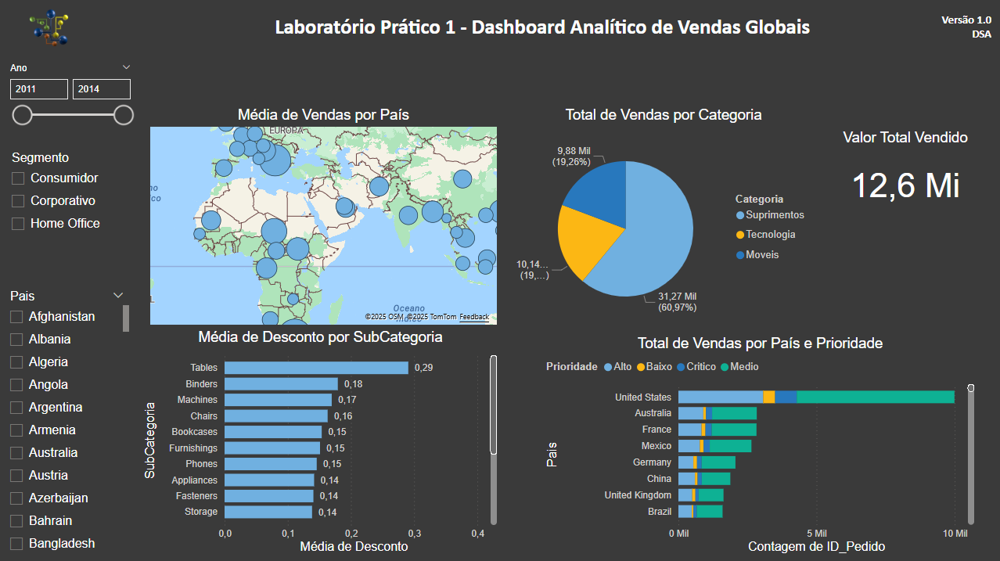

# 📊 Dashboard Analítico de Vendas Globais

Este projeto é um dashboard interativo criado no Power BI, com o objetivo de analisar e visualizar dados de vendas globais por país, categoria, subcategoria e prioridade. O foco principal é demonstrar habilidades em visualização de dados e construção de relatórios gerenciais.

## 🧠 Objetivo

- Analisar o desempenho de vendas globais entre os anos de 2011 e 2014.
- Observar o comportamento por região geográfica, segmento de cliente, categoria e subcategoria de produto.
- Explorar a média de descontos aplicados e o volume total de vendas por país.
- Praticar a criação de dashboards limpos, objetivos e funcionais no Power BI.

## 🛠️ Ferramentas Utilizadas

- Microsoft Power BI
- Visuals nativos (gráficos de barra, gráfico de pizza, mapa interativo)
- Filtros, segmentações e formatações personalizadas

> ⚠️ Ainda não utilizei DAX neste projeto. Usei o Power Query apenas para verificar tipos de dados, sem aplicar transformações.

## 📁 Arquivo do Power BI

Você pode baixar o arquivo `.pbix` usado neste projeto clicando no link abaixo:

👉 [Download do Dashboard Power BI](./dashboard-vendas-globais-powerbi.pbix)

## ⚠️ Aviso

Este projeto foi desenvolvido apenas para fins educacionais.  
Todos os dados apresentados, bem como a empresa representada, são **totalmente fictícios**.  
Esse material foi baseado em um exercício prático da **Data Science Academy (DSA)**.

## 👩‍💻 Autora

Izabella Agostini Moretto  
[LinkedIn - Izabella Moretto](https://www.linkedin.com/in/izabella-moretto)
